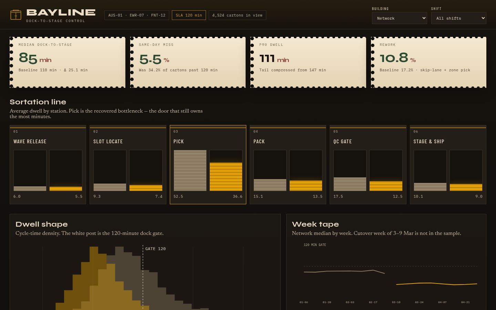
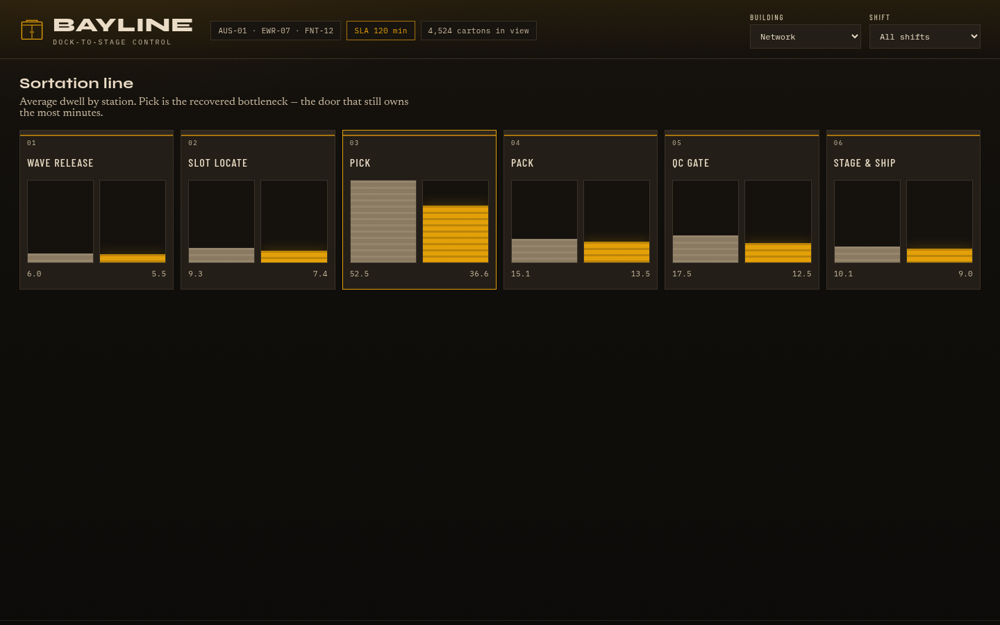
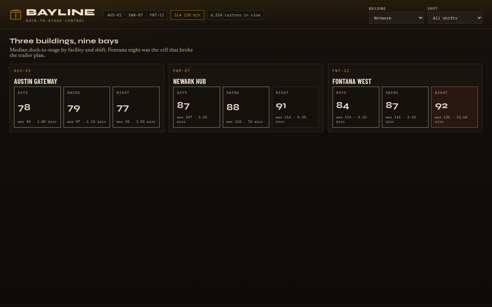
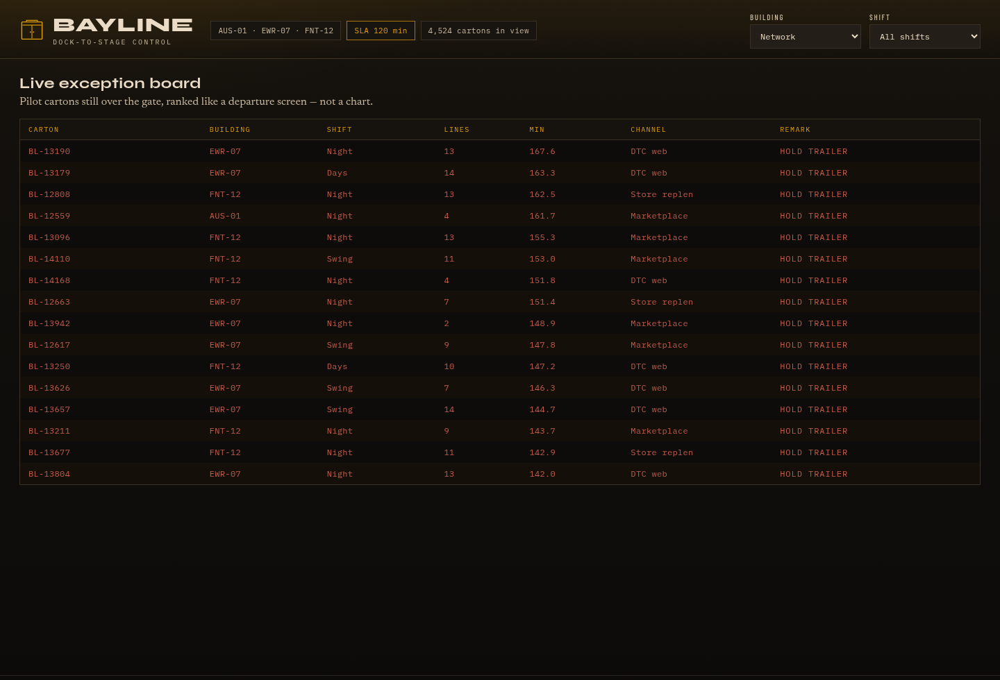
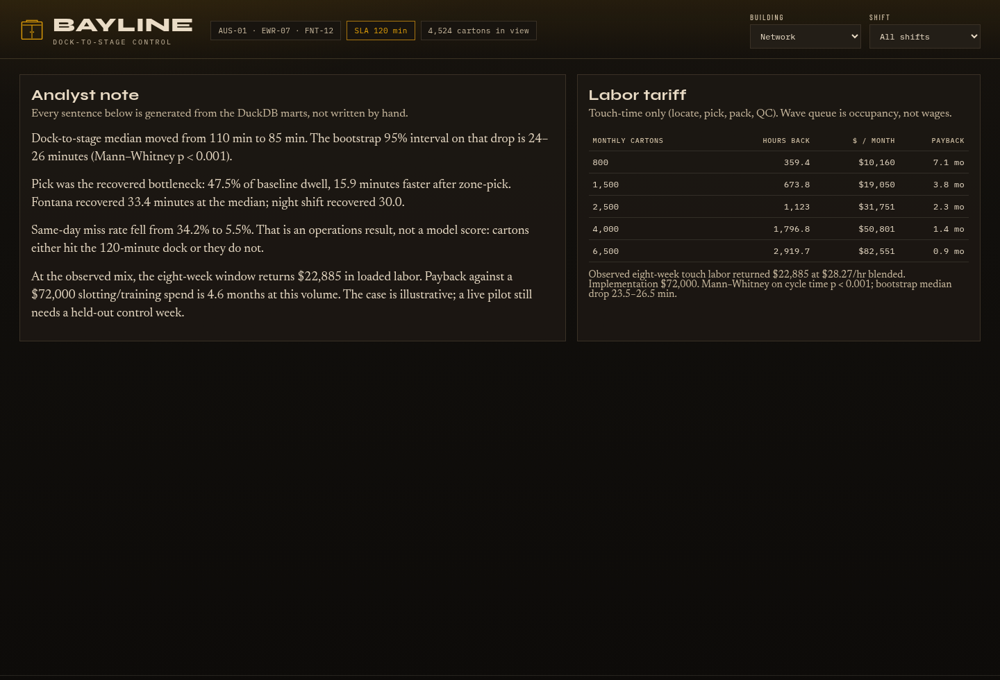

# Bayline — same-day fulfillment control

A three-building dock-to-stage case study. Not a red-vs-green KPI poster: a **control board** for Austin Gateway, Newark Hub, and Fontana West, with SQL marts, a Mann–Whitney test, and a labor tariff that a warehouse manager could argue with.

The question is operational, not decorative: **why did Fontana night miss the 120-minute trailer, and did zone-pick plus skip-lane QC actually move the gate?**

<p align="center">
  
</p>

## What changed

| | Baseline (8 weeks) | Pilot (8 weeks) |
|---|---:|---:|
| Cartons | 2,220 | 2,304 |
| Median dock-to-stage | 110 min | **85 min** |
| P90 | 147 min | 111 min |
| Same-day miss (cycle > 120 min) | 34.2% | **5.5%** |
| Fontana night miss | 79.9% | 15.6% |
| Rework | 17.2% | 10.8% |
| Touch-labor recovered in-window | — | **$22.9k** at $28.27/hr blended |

Bootstrap 95% CI on the median drop: **24–26 minutes**. Mann–Whitney on cycle time: **p < 0.001**. Implementation assumption: **$72k** slotting, relabel, training. Payback at observed volume: **4.6 months**.

The datasets are a seeded, illustrative network (seed 42). Treat the method as the portfolio piece; a live pilot still needs a held-out control week.

## The story the board is built to tell

1. **Define.** Same-day gate is 120 minutes from wave drop to stage. Fontana night was the cell that broke the trailer plan.
2. **Measure.** Star schema: facilities, steps, orders, step dwell, exceptions. Medians and p90, not just averages.
3. **Analyze.** Pick was 47.5% of baseline dwell. Multi-line cartons and Fontana night travel dominate. SQL uses `JOIN`, `RANK() OVER`, `LAG`, and `QUANTILE_CONT`.
4. **Improve.** Zone-pick (biggest cut at Fontana) + QC skip-lane for low-risk 1–2 line DTC work.
5. **Control.** The live board filters by building and shift. Residual Fontana night miss is 15.6% — the redesign is not a miracle.

<p align="center">
  
</p>

<p align="center">
  
</p>

<p align="center">
  
</p>

<p align="center">
  
</p>

## Open the control board

```bash
python -m pip install -r requirements.txt
python -m bayline          # rebuild CSVs + dashboard/metrics.json
python -m http.server 8000 --directory dashboard
```

Then open http://localhost:8000. Building and shift filters recompute the tickets, density, and exception board from the order grain.

## Reproduce the analysis

```bash
python -m pytest -q
```

CI runs the same suite: schema integrity, Fontana-night as the baseline problem cell, SQL scorecard vs pandas, window ranks, and a monotonic labor tariff.

## Repository map

```text
bayline/           generate, DuckDB marts, statistical export
sql/analysis.sql   interview-grade SQL (the source of truth for KPIs)
data/              dim_facility, dim_step, fact_orders, fact_order_steps, fact_exceptions
dashboard/         Bayline control board (static HTML + metrics.json)
tests/             pytest
docs/screenshots/  captured from the live board, not matplotlib posters
```

Labor dollars use **touch time only** (locate, pick, pack, QC). Wave-release queue is occupancy, not wages. Cycle time still includes queue, because the trailer does not care why a carton was late.

## Skills this is meant to show

SQL with joins and window functions, KPI design, before/after inference, heterogeneous treatment effects, executive narrative generated from marts, and an interface that looks like a dock door rather than a tutorial dashboard.
