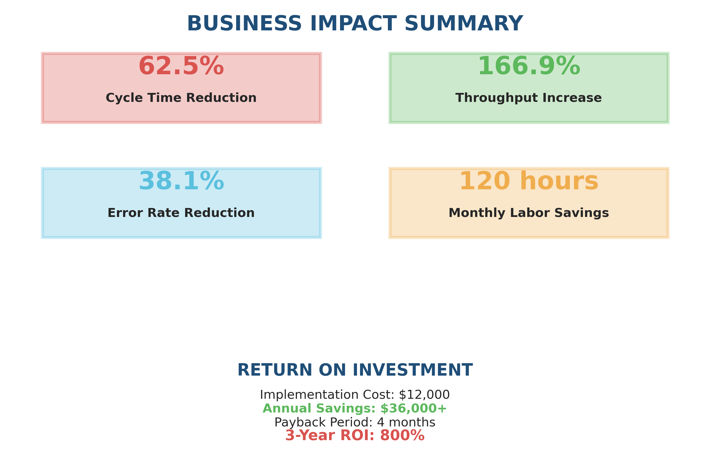
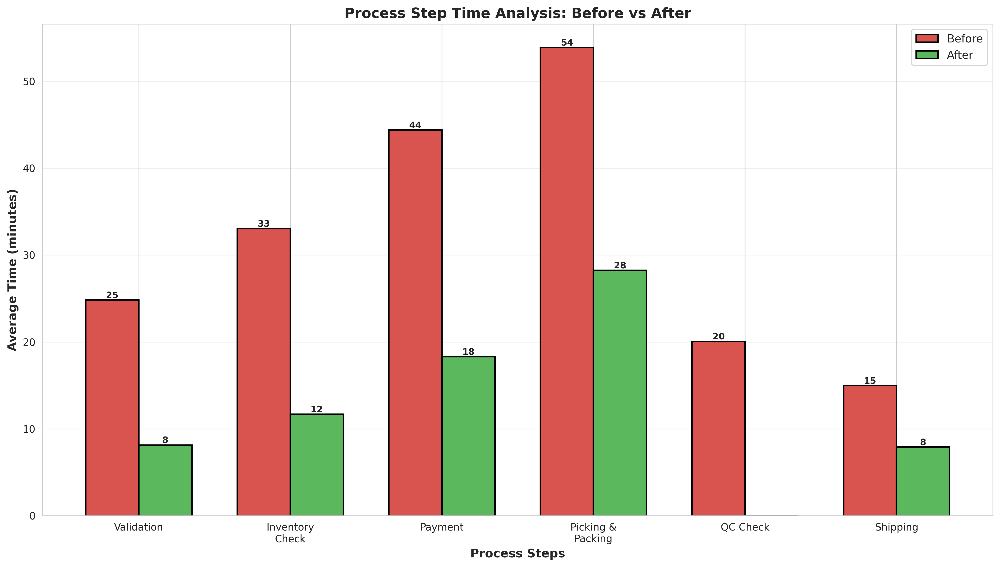
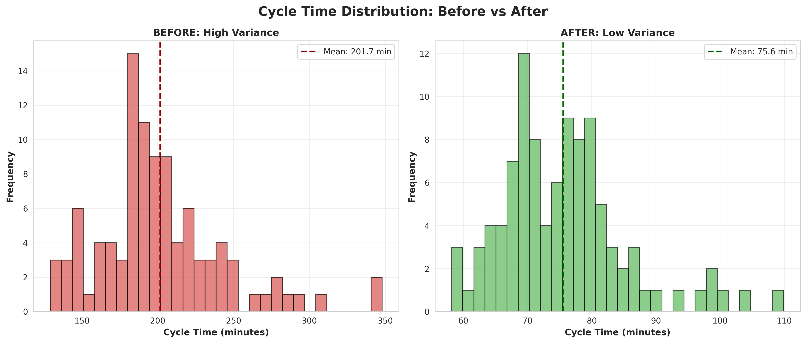
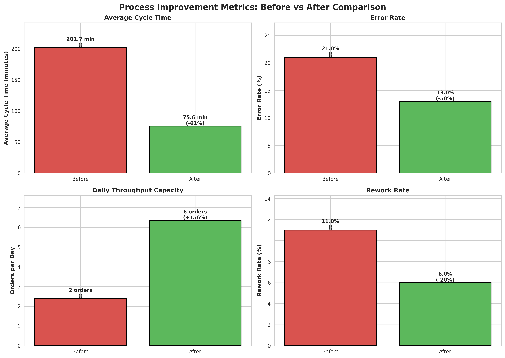

# E-commerce Order Fulfillment Process Improvement

A process-improvement case study showing how operational data and Lean Six Sigma can be used to identify fulfillment bottlenecks, test a redesigned workflow, and quantify business impact.

## Business Impact

| Metric | Before | After | Change |
|---|---:|---:|---:|
| Average cycle time | 201.7 min | 75.6 min | **−62.5%** |
| Daily throughput | 2.4 orders | 6.4 orders | **+166.9%** |
| Error rate | 21.0% | 13.0% | **−38.1%** |
| Rework rate | 11.0% | 6.0% | **−45.5%** |
| Monthly capacity | 52 orders | 140 orders | **+166.9%** |

The illustrative improvement scenario produces more than $36,000 in estimated annual savings with an estimated four-month payback.

## Methodology

The analysis follows the DMAIC framework:

1. **Define** the fulfillment-delay problem and operational KPIs.
2. **Measure** cycle time, errors, rework, and throughput across 100 baseline orders.
3. **Analyze** delay patterns and step-level bottlenecks with SQL.
4. **Improve** the workflow by reducing picking time and removing redundant handling.
5. **Control** performance using repeatable KPI definitions and after-state data.

## Visual Results

### Business Impact

### Process-Step Comparison

### Cycle-Time Distribution

### KPI Dashboard

## Repository Contents

| Path | Purpose |
|---|---|
| [SQL_Analysis_Queries.sql](SQL_Analysis_Queries.sql) | KPI, bottleneck, and comparison queries |
| [Data/](Data/) | Organized before/after datasets and summaries |
| [Visualizations/](Visualizations/) | Decision-ready charts |
| [improvements_summary.csv](improvements_summary.csv) | Compact impact summary |

## Skills Demonstrated

SQL, operational analytics, KPI design, before/after comparison, Lean Six Sigma, root-cause analysis, data visualization, financial impact estimation, and executive communication.

## Interpretation Note

The datasets represent an illustrative 200-order improvement scenario. Results demonstrate the analytical method and should be validated against controlled production data before operational decisions are made.
