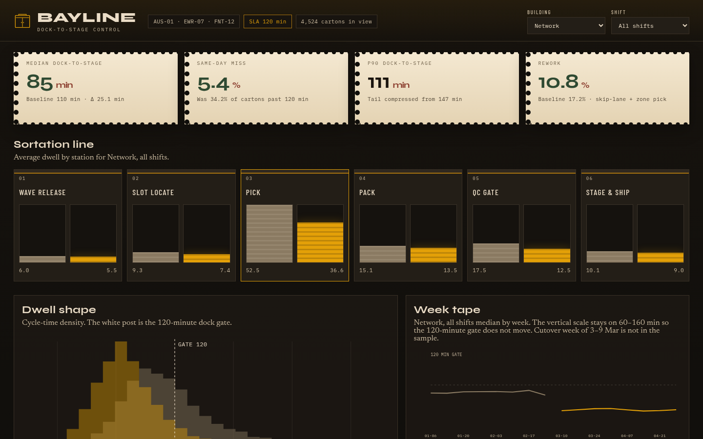
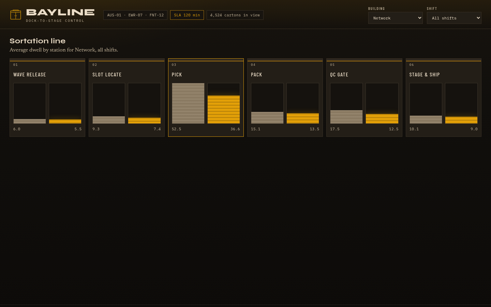
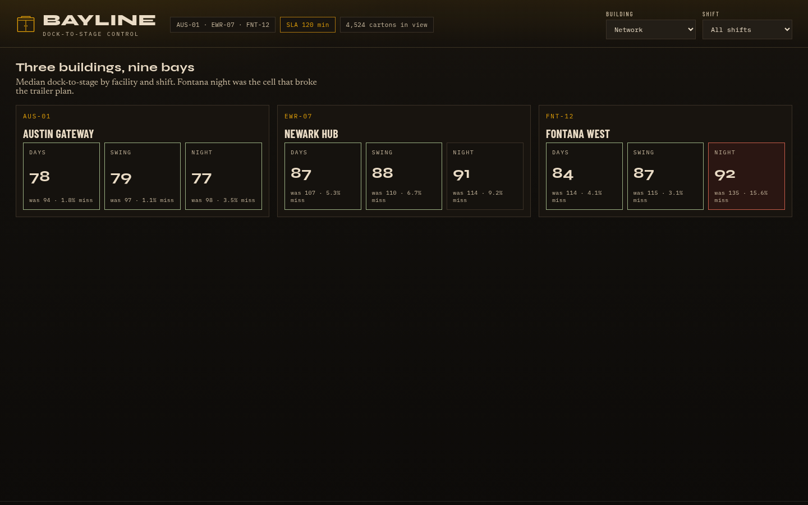
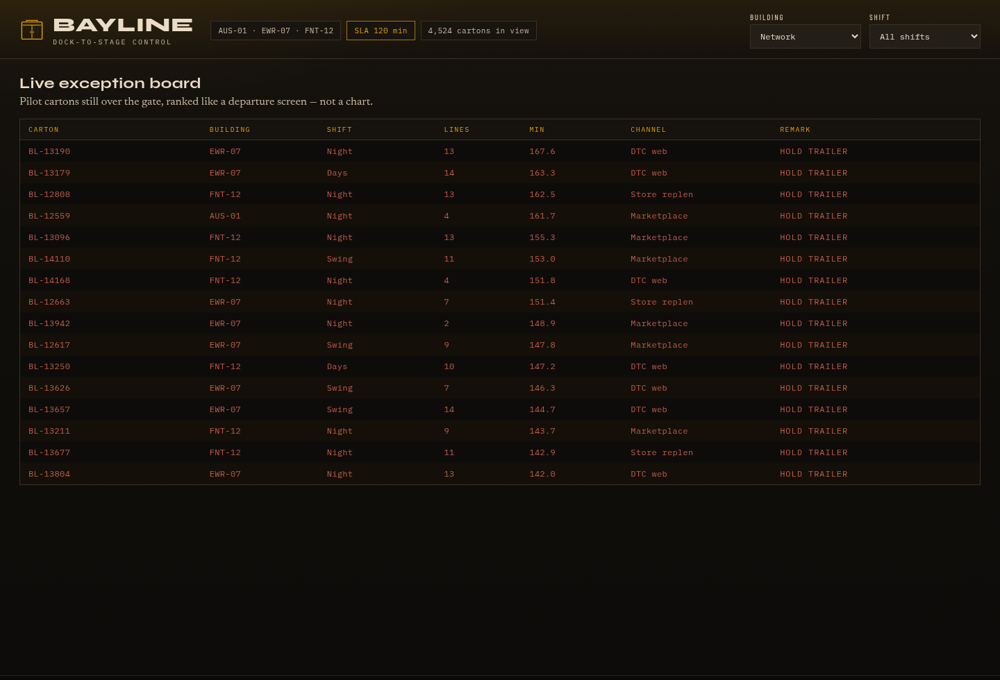
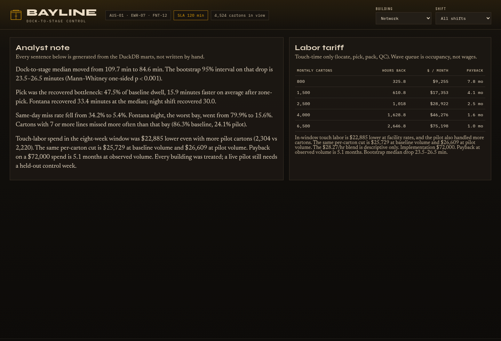

# Bayline — same-day fulfillment control

[](https://parbproject.github.io/E-commerce-Order-Fulfillment-Process-Improvement/)

**Live demo (no sign-in):** [parbproject.github.io/E-commerce-Order-Fulfillment-Process-Improvement](https://parbproject.github.io/E-commerce-Order-Fulfillment-Process-Improvement/)

**Lead project for a data analyst application.** Open the control board below, then the SQL in `sql/analysis.sql`. The interview story is a bottleneck, a before/after, and a labor dollar figure — not a chart template.

A three-building dock-to-stage case study. Not a red-vs-green KPI poster: a **control board** for Austin Gateway, Newark Hub, and Fontana West, with SQL marts, a Mann–Whitney test, and a labor tariff that a warehouse manager could argue with.

The question is operational, not decorative: **why did Fontana night miss the 120-minute trailer, and did zone-pick plus skip-lane QC actually move the gate?**

<p align="center">
  
</p>

## What changed

| | Baseline (8 weeks) | Pilot (8 weeks) |
|---|---:|---:|
| Cartons | 2,220 | 2,304 |
| Median dock-to-stage | 109.7 min | **84.6 min** |
| P90 | 147.3 min | 111.4 min |
| Same-day miss (cycle > 120 min) | 34.2% | **5.4%** |
| Fontana night miss | 79.9% | 15.6% |
| Rework | 17.2% | 10.8% |
| Touch-labor recovered in-window | — | **$22,885** at facility rates |

Bootstrap 95% CI on the median drop: **23.5–26.5 minutes** (the median of that bootstrap is 25.1). One-sided Mann–Whitney on cycle time: **p < 0.001** (the two-sided p-value is also under 0.001). Implementation assumption: **$72k** slotting, relabel, training. Payback at observed volume: **5.1 months**.

The control board rounds the median and the P90 to the nearest minute (110, 85, 147, 111). The order-weighted labor-rate blend is **$28.27/hr**; the $22,885 figure is priced at each building's own rate, not at that blend. Rebuild with `python -m bayline` and these rows match `kpi_period`, `sla_cells`, and `dashboard/metrics.json`.

The datasets are a seeded, illustrative network (seed 42). Treat the method as the portfolio piece; a live pilot still needs a held-out control week.

## The story the board is built to tell

1. **Define.** Same-day gate is 120 minutes from wave drop to stage. Fontana night was the cell that broke the trailer plan.
2. **Measure.** Star schema: facilities, steps, orders, step dwell, exceptions. Medians and p90, not just averages.
3. **Analyze.** Pick was 47.5% of baseline dwell. Fontana night is the worst bay (79.9% miss), but 7+ line cartons miss more often (86.3% baseline). SQL uses `JOIN`, `RANK() OVER`, `LAG`, and `QUANTILE_CONT`.
4. **Improve.** Zone-pick (biggest cut at Fontana) + QC skip-lane for low-risk 1–2 line DTC and marketplace cartons. Store replen stays on the full QC gate.
5. **Control.** The live board filters by building and shift. Network same-day miss in the pilot is 5.4%. Residual Fontana night miss is 15.6% — the redesign is not a miracle.

<p align="center">
  
</p>

<p align="center">
  
</p>

<p align="center">
  
</p>

<p align="center">
  
</p>

## Open the control board

The public demo is a static site: a short landing page plus the control board. GitHub Actions runs `python -m bayline` on every push to `main` and deploys the result with `actions/upload-pages-artifact` and `actions/deploy-pages`. The same build step is in CI, so a broken export fails the check.

Locally:

```bash
python -m pip install -r requirements.txt
python -m bayline          # rebuild CSVs + dashboard/metrics.json
python -m http.server 8000
```

Then open http://localhost:8000 for the landing page, or http://localhost:8000/dashboard/ for the board. The landing page reads `dashboard/metrics.json` (scenario toggle and building filter). On the board, building and shift filters recompute the tickets, density, sortation dwell, week tape, and exception board. Dwell and the week tape for a shift come from `step_by_cell` and `weekly_cell`, not from the all-shift averages. Serve the dashboard directory alone if you only want the board:

```bash
python -m http.server 8000 --directory dashboard
```

## Reproduce the analysis

```bash
python -m pytest -q
```

CI runs `python -m bayline` and then the same suite: schema integrity, the SLA flag against stored cycle time, Fontana-night as the baseline problem cell, SQL scorecard vs pandas, window ranks, touch-labor invariants, and a monotonic labor tariff.

## Repository map

```text
bayline/           generate, DuckDB marts, statistical export
sql/analysis.sql   interview-grade SQL (the source of truth for KPIs)
data/              dim_facility, dim_step, fact_orders, fact_order_steps, fact_exceptions
index.html         public landing page (reads dashboard/metrics.json)
dashboard/         Bayline control board (static HTML + metrics.json)
.github/workflows/pages.yml
                   build on main, deploy to GitHub Pages
tests/             pytest
docs/screenshots/  captured from the live board, not matplotlib posters
```

Labor dollars use **touch time only** (locate, pick, pack, QC), priced at each building's rate. Wave-release queue and stage time are occupancy, not wages. The in-window $22,885 is baseline touch hours minus pilot touch hours, so it is not volume-matched: the pilot also handled more cartons. Holding each building's carton count fixed, that same per-carton cut is **$25,729** at the baseline mix and **$26,609** at the pilot mix. Payback holds the observed per-carton touch time constant and scales it to a 26-day month. It is not the raw $22,885. Cycle time still includes queue, because the trailer does not care why a carton was late. A stored cycle of exactly 120.0 minutes is on the gate; miss means strictly greater than 120. Every building received the pilot; Austin is an easier layout, not an untreated control.

## Skills this is meant to show

SQL with joins and window functions, KPI design, before/after inference, heterogeneous treatment effects, executive narrative generated from marts, and an interface that looks like a dock door rather than a tutorial dashboard.
